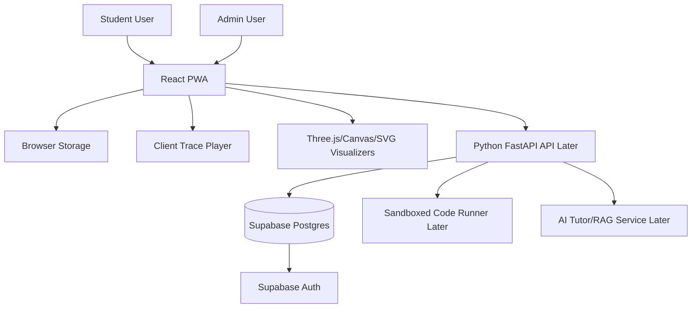
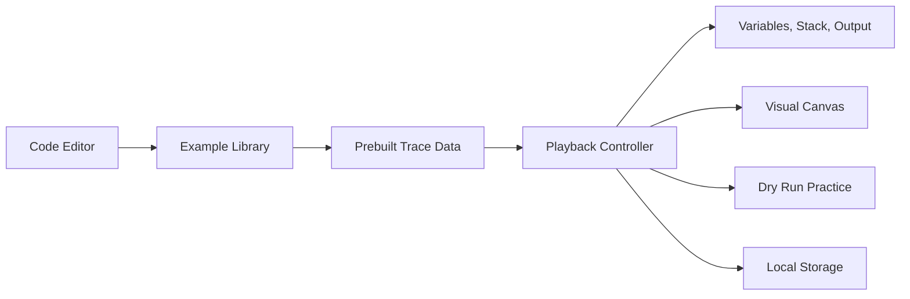
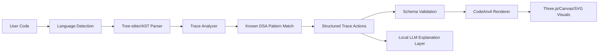
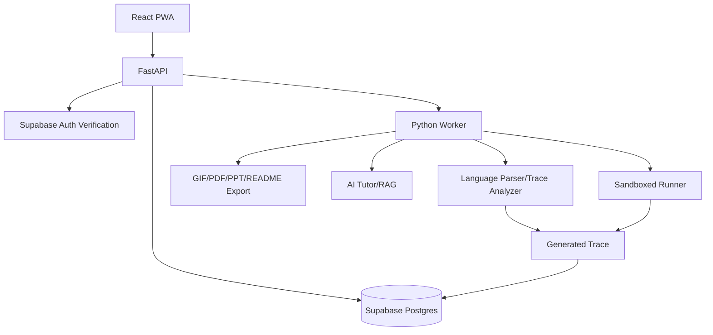

# Architecture

## Architecture Goals

- Fast frontend-first MVP
- Clean trace format
- Secure path toward backend and multiplayer
- No unsafe arbitrary code execution
- Easy migration from local storage to Supabase
- Admin and user dashboards supported later

## High-Level Architecture

## MVP Architecture

For MVP, CodeAnvil can run without a backend.

MVP design decision:

- Use prebuilt traces for sample programs first.
- Do not run arbitrary user code in production MVP.
- Add a trace generator later when sandboxing is ready.

## Universal Code Visualization Architecture

The long-term paste-code feature should not generate Three.js code directly.

Instead:

Known algorithms should map to polished templates. Unknown code should fall back to a generic execution storyboard. AI can help explain and classify, but the renderer must only consume validated trace data.

## Core Runtime Concepts

Trace:

- ordered list of execution steps
- each step has line number, operation, variables, stack, output, and explanation

Visualizer:

- reads trace steps
- renders variable boxes, stack frames, tree nodes, arrays, grids, or graphs

Playback Controller:

- controls current step
- supports play, pause, step forward, step backward, reset, speed

Practice Engine:

- pauses at selected steps
- asks user to predict next value, next output, or next line
- records accuracy

## Future Backend Architecture

## Security Boundaries

Important trust boundaries:

- browser to API
- API to database
- API to sandbox
- admin dashboard to privileged actions
- user-submitted code to trace engine
- public user content to frontend rendering

Most important rule:

Never trust code, text, JSON, uploaded files, local storage, route params, or API responses as safe without validation.

