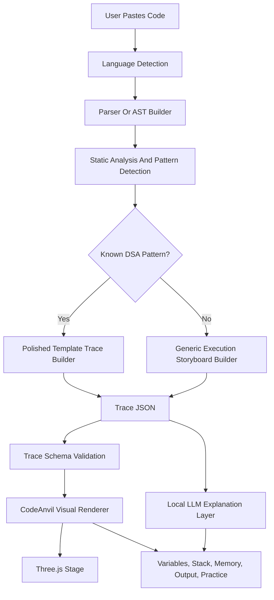

# Universal Code Visualization

## Purpose

This document defines the long-term "paste any code" architecture for CodeAnvil.

The goal is not to ask AI to write new Three.js animation code for every snippet. The reliable path is:

```text
user code -> analysis pipeline -> structured trace actions -> CodeAnvil renderer
```

CodeAnvil owns the visual engine. Parsers, analyzers, sandboxes, and local LLMs only produce or explain trace data.

## Product Promise

Users should eventually be able to paste code in common languages and get a visual explanation even when the snippet was not one of our hand-authored examples.

The quality tiers are:

- Curated DSA examples: polished, hand-authored, production-quality animations.
- Recognized algorithm patterns: map user code to polished templates such as binary search, merge sort, BFS, DFS, stack, queue, tree traversal, graph traversal, and DP tables.
- Unknown code: generate a generic execution storyboard with line highlights, variable changes, call stack, memory snapshots, output, and simple visual actions.
- Unsupported or unsafe code: explain why it cannot be visualized yet and offer a safer rewrite or closest supported example.

## Core Decision

Do not generate raw Three.js code from user input.

Reasons:

- generated rendering code is hard to validate
- visual quality would be inconsistent
- hallucinated UI code can break the app
- untrusted code paths increase security risk
- every animation should follow the same playback controls, accessibility rules, and visual language

Instead, generate a trace document with structured action payloads. The renderer reads those actions and chooses the correct Three.js, Canvas, SVG, or DOM visualization.

## Pipeline



## Language Strategy

Start narrow, then expand.

Early:

- JavaScript/TypeScript: parse with a JS parser or Tree-sitter grammar.
- Python: parse with Python `ast` for safe beginner subsets.
- C/C++/Java: use Tree-sitter for structure first, then add controlled execution or tracing later.

Later:

- add language-specific trace adapters
- add sandboxed execution only after isolation is proven
- keep language-specific logic behind a common trace schema

## Analysis Responsibilities

The analyzer should produce facts, not visuals.

It can detect:

- assignments
- conditions
- loop iterations
- function calls and returns
- recursion
- comparisons
- swaps
- array reads and writes
- pointer movement
- stack and queue operations
- graph or tree traversal events
- output writes
- likely algorithm pattern

It should output trace actions such as:

```json
{ "type": "compare", "items": ["i", "j"] }
{ "type": "swap", "items": ["i", "j"] }
{ "type": "visit_node", "node": "A" }
{ "type": "push", "target": "stack", "value": 7 }
{ "type": "pointer_move", "pointer": "left", "to": 3 }
```

## Local LLM Role

A local hosted LLM can help with:

- language detection when heuristics are uncertain
- identifying likely DSA patterns
- explaining steps in student-friendly language
- mapping messy code to a known visualization template
- generating practice questions from a validated trace
- suggesting why a snippet is unsupported

The LLM should not be the only source of truth for execution state.

Rules:

- LLM output must be validated against the trace schema.
- LLMs should generate explanations and trace hints, not raw Three.js source code.
- If a parser or sandbox disagrees with the LLM, trust the parser/sandbox.
- Low-confidence analysis should be labeled as best-effort.

## Renderer Responsibilities

The renderer should:

- accept only validated trace JSON
- map trace actions to visual components
- keep playback controls consistent
- support step forward, step backward, play, pause, reset, and speed
- show current line, variables, stack, memory, output, and explanation
- use Three.js for smooth 3D/arena-style visualizations where it improves clarity
- use simpler DOM/SVG/Canvas panels when 3D would reduce clarity

## Renderer Quality Contract

The renderer is a CodeAnvil-owned product surface, not an output blob from AI.

The first renderer target is a forge workbench:

- action badge names the semantic action for the current step
- source line, action strip, visual stage, and inspector agree with each other
- compare steps show operands and predicate result
- swap steps show two distinct movement paths so students can track both values
- recursion steps show frames entering, waiting, returning, and leaving
- output steps show cumulative program output
- reduced motion must keep all final states readable

A renderer is not accepted if it only animates shapes without explaining the algorithm decision.

## MVP Boundary

The MVP should still prioritize curated examples and polished DSA animations.

Universal code visualization is a future advanced layer. It should not delay:

- Code Playback Lab
- recursion visualizer
- sorting visualizer
- BFS/DFS visualizer
- dry-run practice
- saved sessions

## Security Boundary

Treat pasted code as hostile input.

Before real execution:

- use static parsing where possible
- reject unsupported syntax clearly
- limit code size
- validate generated traces
- avoid sending private code to cloud AI without user consent

When execution is added:

- run only in isolated sandboxes
- disable network by default
- enforce CPU, memory, time, filesystem, and output limits
- never mount production secrets

## Success Criteria

This architecture succeeds when:

- known DSA code maps to polished animations
- unknown code still gets a useful execution storyboard
- the renderer stays stable even when analysis is imperfect
- explanations are helpful without pretending to be perfect
- security rules remain stronger than the demo pressure
